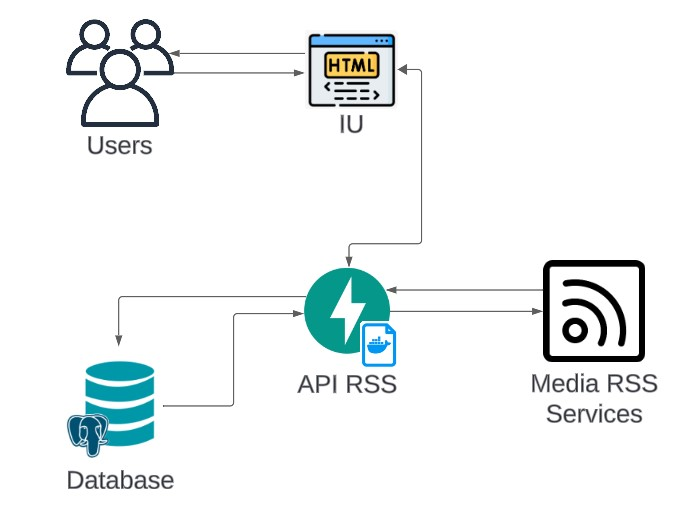

# API News

## Introducción de la API

Esta API permite la gestión y consulta de noticias a través de diferentes categorías obtenidas mediante RSS La API está desarrollada con **FastAPI** y utiliza `SQLAlchemy` para la gestión de la base de datos **PostgreSQL**.

## Diagrama de arquitectura



## ¿Cómo está dividida la API?

### Estructura del proyecto

- `config/`
	- db.py - Archivo de configuración de la base de datos.
- `models/`
	- models.py - Archivo que contiene los modelos de la base de datos.
- `routes/`
	- news.py - Archivo que contiene las rutas de la API.
- `services/`
	- news.py - Archivo que contiene todas las funciones de lógica.
- `templates/`
	- `index.html` - Archivo **HTML** para la interfaz de usuario. 
- `main.py` - Archivo principal de la API donde se incluyen las rutas.
- `requirements.txt` - Archivo con las librerías y paquetes necesarios.

### Componentes

`main.py`: Contiene la configuración principal de **FastAPI** y la inclusión de las rutas desde el módulo `routes`.

`config/db.py`: Configuración de la base de datos, creación del motor y sesión de **SQLAlchemy**

`models/models.py`: Definición de los modelos de la base de datos utilizando **SQLAlchemy**

`routes/news.py`: Definición de todas las rutas de la API

**Rutas:**
-   `/`: Renderiza el `index.html`.
-   `/validate_prompt`: Valida si un titular dado existe en la base de datos.
-   `/save_news`: Guarda las noticias obtenidas de los RSS en la base de datos (más específicamente en la tabla News).
-   `/news_by_category`: Obtiene todas las noticias clasificadas por categoría y las devuelve en formato JSON.

`services/news.py`: Contiene todas las funciones de lógica

`templates/index.html`: Proporciona la interfaz de usuario para buscar y validar titulares de noticias, así como para guardar nuevas noticias.

## Ejecutemos la API

### Iniciamos un entorno virtual (Opcional)

-   Abre una terminal y navega al directorio del proyecto.
-   Crea el entorno:

```
python -m venv venv 
```

- Activa el entorno creado (Para Windows):

```
.\venv\Scripts\activate
```

### Instalamos los requerimientos

-   Cuando tengas el entorno virtual activado, puedes instalar las dependencias necesarias:

```
pip install -r requirements.txt
```

### Clonar y ejecutar

- Clonamos el repo:

```
git clone https://github.com/Lagares02/TrueShield-API-RSS.git
cd TrueShield-API-RSS
```

- Configura tus variables de entorno para la conexión de la base de datos

```
DB_USER = tu_usuario
DB_PASSWORD = tu_contraseña
DB_HOST = tu_host
DB_NAME = tu_nombre_de_base_de_datos
```

- Iniciamos el servidor con tan solo:

```
py main.py
```

- Abre tu navegador y navega a `http://127.0.0.1:8001` para ver la interfaz de usuario.